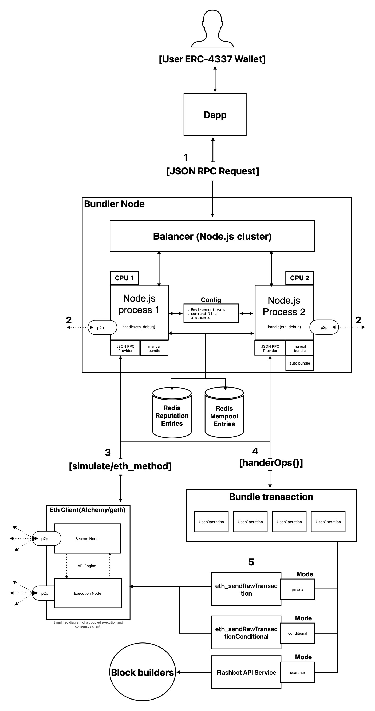
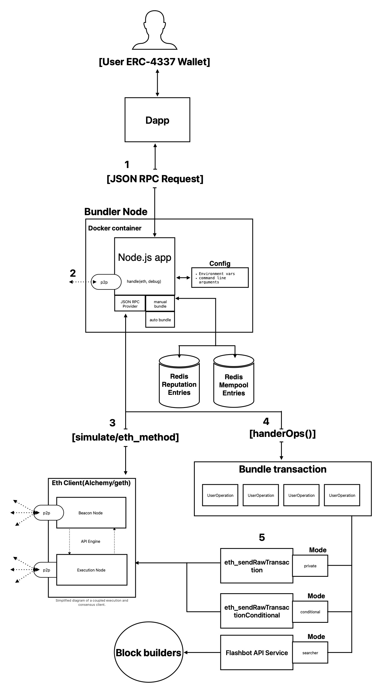

## Bundler High-level Architecture
Transeptor provides two Node.js runtime configurations to suit your needs. You can run it using the Docker configuration for a container architecture. Or, you can use the cluster configuration for a standalone machine architecture.

See roadmap [here](https://hackmd.io/@V00D00-child/SyXKL6Kmn#Project-StatusRoadmap-) 

### Clusters architecture
1. Dapps allow users to send user operations from ERC-4337 compatible wallets to a ERC-4337  Bundler.
2. The Bundler node will broadcast received user operations and retrieves other user operations by connection to other bundlers' in the p2p network.
3. The Bundler node connects to an ETH client(execution client) to retrieve information about Ethereum accounts (balances, stake/deposit info, etc.). It will also use the ETH client to simulate user operation using debug_traceCall for full validation.
4. The Bundler node will retrieve user operations from the mempool, create bundle transactions.
5. The bundle transactions will be sent on-chain using Flashbots service, or eth_sendRawTransactionConditional to protect the bundle transaction from front-running and allow block builders to propose to the Ethereum network.

### Docker Container architecture
1. Dapps allow users to send user operations from ERC-4337 compatible wallets to a ERC-4337  Bundler.
2. The Bundler node will broadcast received user operations and retrieves other user operations by connection to other bundlers' in the p2p network.
3. The Bundler node connects to an ETH client(execution client) to retrieve information about Ethereum accounts (balances, stake/deposit info, etc.). It will also use the ETH client to simulate user operation using debug_traceCall for full validation.
4. The Bundler node will retrieve user operations from the mempool, create bundle transactions.
5. The bundle transactions will be sent on-chain using Flashbots service, or eth_sendRawTransactionConditional to protect the bundle transaction from front-running and allow block builders to propose to the Ethereum network.

