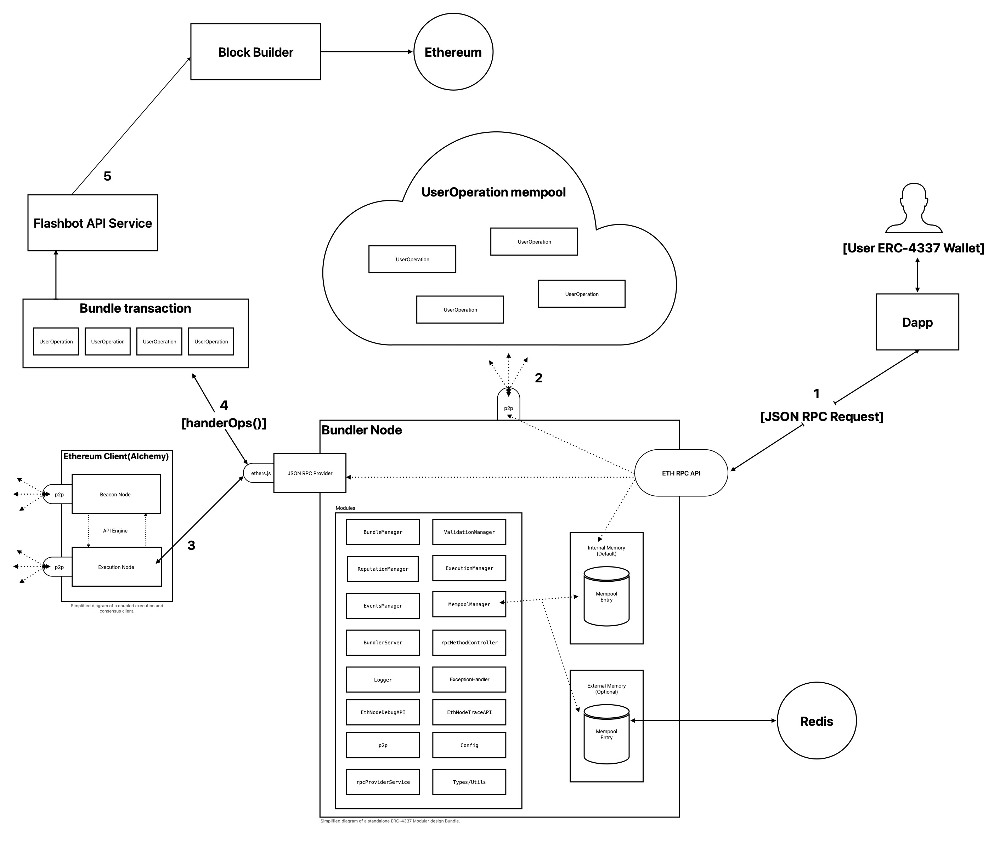

## Bundler High-level Architecture
Modular design is an approach that can greatly improve the software's structure, maintainability, and scalability when designing a software project. This approach involves breaking down a software system into smaller, independent modules or components, each with defined functionality. We will use a Modular design for the Bundler architecture to achieve encapsulated complexity. 

By adopting a Modular design approach, developers can focus on creating individual modules that perform a specific function or task and ensure that each module is loosely coupled and has minimal dependencies on other modules. Having developers focus on creating individual modules can reduce development time and simplify system scaling as new features are introduced, or requirements change.

Modular design can also improve code reuse, as modules can be shared across different applications or projects, saving time and effort. Additionally, using a modular design approach makes it easier to test each module in isolation, reducing the likelihood of introducing bugs or errors into the system.

Overall, Modular design is a powerful tool that can help to create maintainable, scalable, and efficient software projects, making it an essential practice for modern software development.

1. Dapps allow users to send user operations from ERC-4337 compatible wallets to the ETH RPC API endpoint as JSON-RPC requests.
2. The Bundler node will broadcast received user operations and retrieves other user operations by connection to other bundlers' in the p2p network.
3. The Bundler node connects to an ETH client(execution client) to retrieve information about Ethereum accounts (balances, stake/deposit info, etc.). It will also use the ETH client to simulate user operation by making calls to the debug and trace namespace.
4. The Bundler node will retrieve user operations from the mempool, create bundle transactions.
5. The bundle transactions will be sent on-chain using Flashbots service, or eth_sendRawTransactionConditional to protect the bundle transaction from front-running and allow block builders to propose to the Ethereum network.

See roadmap [here](https://hackmd.io/@V00D00-child/SyXKL6Kmn#Project-StatusRoadmap-) 
