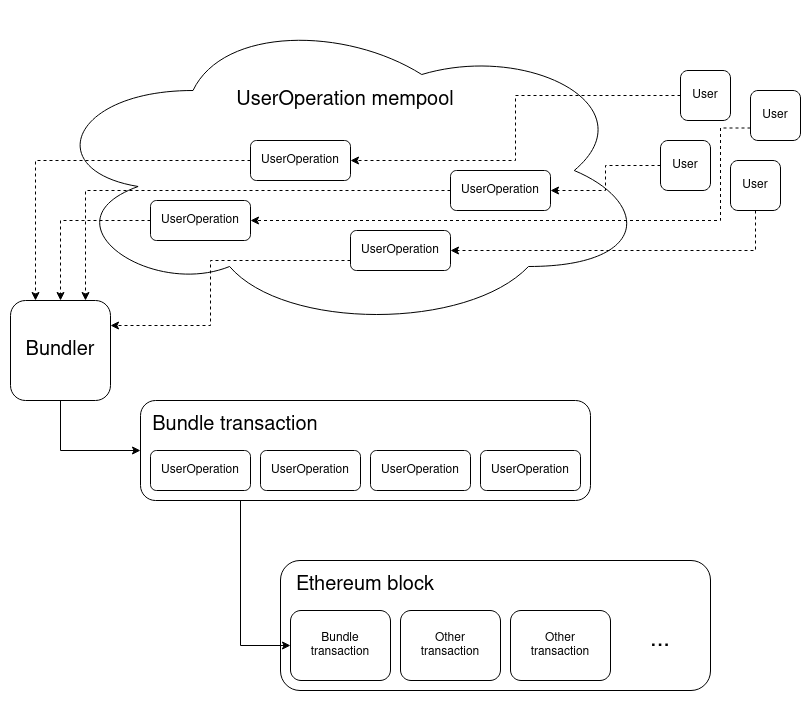

## What is ERC-4337
ERC-4337 is a new protocol feature that changes the bottom-layer transaction type; this proposal introduces a higher-layer transaction object called a `UserOperation`. Users can broadcast signed UserOperation objects into a separate mempool where a decentralized network of actors named `Bundlers` relays their transactions to block builders via a singleton smart contract instance called an `Entrypoint`. ERC-4337  also allows users to have their transaction fees subsidized by application developers and enable users to pay fees with ERC-20 token.

### UserOperation Type
Users package up the action they want their account to take in an ABI-encoded struct called a UserOperation:

|        **Field**       |  **Type** |                                                             **Description**                                                             |
|:----------------------:|:---------:|:---------------------------------------------------------------------------------------------------------------------------------------:|
| `sender`               | `address` | The account making the operation                                                                                                        |
| `nonce`                | `uint256` | Anti-replay parameter; also used as the salt for first-time account creation                                                            |
| `initCode`             | `bytes`   | The initCode of the account (needed if and only if the account is not yet on-chain and needs to be created)                             |
| `callData`             | `bytes`   | The data to pass to the `sender` during the main execution call                                                                         |
| `callGasLimit`         | `uint256` | The amount of gas to allocate the main execution call                                                                                   |
| `verificationGasLimit` | `uint256` | The amount of gas to allocate for the verification step                                                                                 |
| `preVerificationGas`   | `uint256` | The amount of gas to pay for to compensate the bundler for pre-verification execution and calldata                                      |
| `maxFeePerGas`         | `uint256` | Maximum fee per gas (similar to [EIP-1559](https://eips.ethereum.org/EIPS/eip-1559) `max_fee_per_gas`)                                  |
| `paymasterAndData`     | `bytes`   | Address of paymaster sponsoring the transaction, followed by extra data to send to the paymaster (empty for self-sponsored transaction) |
| `signature`            | `bytes`   | Data passed into the account along with the nonce during the verification step                                                          |

## How does ERC-4337 work 

There are five main components to ERC-4337: a `UserOperation`, `Bundler`, `EntryPoint Contract`, `Wallet(Account)`, and `Paymaster Contract`.

1. **Wallet(Account)**
    - Wallet contract - a contract representing a user smart contract account
    - Wallet Deployer - a contract(singleton) that creates a wallet contract
    - Wallet software - UX client app used to sign and send the UserOperation to the Bundler node.
2. **UserOperation** - A structure that describes a transaction(new transaction type) sent on a user's behalf. Users send UserOperation objects to a dedicated user operation mempool where Bundlers can listen and create bundle transactions.
    - Like a transaction, it contains `sender`, `to`, `calldata`, `maxFeePerGas`, `maxPriorityFee`, `signature`, and `nonce`.
    - Unlike a transaction, it contains several other fields. 
    - Each account implementation defines the `nonce` and `signature` fields rather than defining them at the protocol level
3. **EntryPoint** - A singleton smart contract instance that executes bundles of UserOperations as a standard transaction.
4. **Bundler** - A Bundler is an extension of a node that listens in on the user operation mempool(alternative mempool) and runs simulations to ensure UserOperations are valid(verify sig/handle gas fee). The Bundler also takes on the responsibility of packaging multiple valid UserOperations into a bundled transaction and then relays the bundles to a supported Entrypoint contract via a transaction to the handleOps() function. Note that not all block-builders on the network are required to be bundlers. If a bundler does not want to be a block-builders, it can use flash bots-like API to bypass the tx mempool. 
5. **Paymaster** - This contract can pay for transactions instead of the wallet itself. Wallet contracts can choose Paymaster to sponsor or pay transactions themselves.

