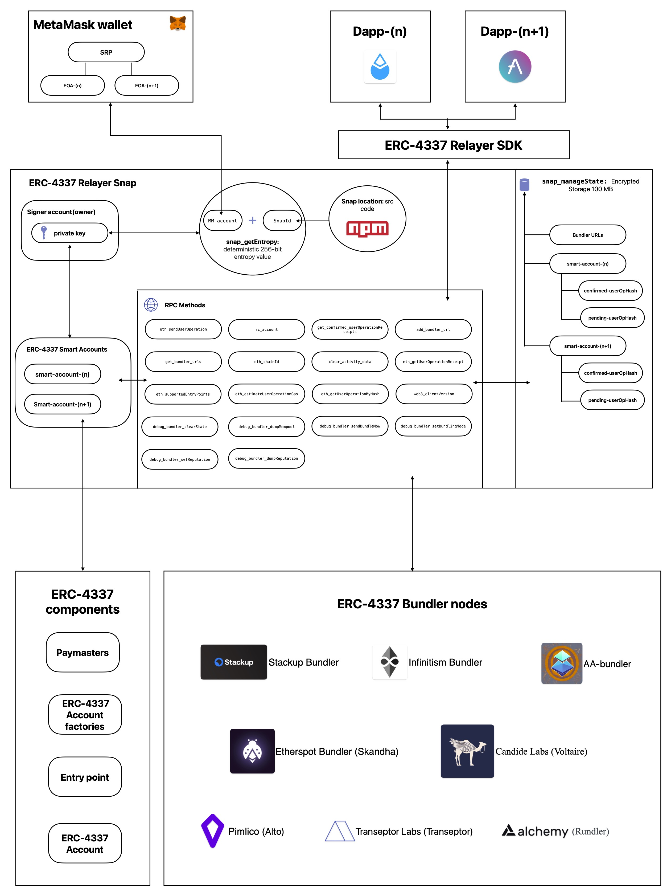

Our solution is to use a MetaMask Snap to modify the functionality of MetaMask to support ERC-4337. Doing so will give builders the tools to modify dapps to support Account Abstraction. The Snap; `SmartHub` facilitates seamless interactions between dApps and the ERC-4337 infrastructure.

## How does the snap work?
1. SmartHub will generate a private key using a deterministic 256-bit value specific to the Snap and the user's MetaMask account(i.e., snapId + MetaMask secret recovery phrase). 
2. The private key is used to create the relayer Ethereum account. The relayer account is the owner of the user's ERC-4337 smart accounts and will sign/send user operations on behalf of the user.
3. SmartHub will prompt users to sign all user operations giving the relayer account permission to get the user Op to a Bundler.
5. SmartHub uses a default list of Bundlers, but users can update this list to use any Bundler they choose.
6. Once a user operation is successfully included in a Bundlers transaction, SmartHub notifies the user via a MetaMask notification.

