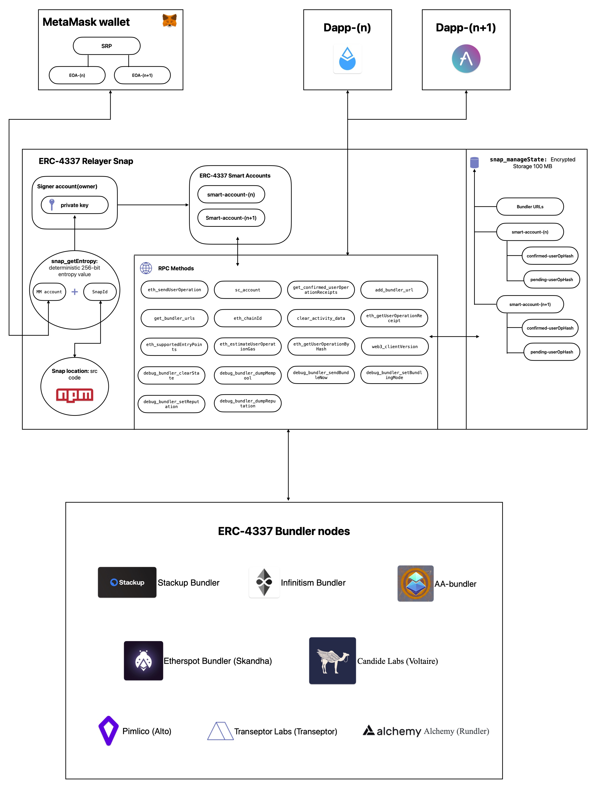

## How does the snap work?
1. The snap will generate a deterministic 256-bit value specific to the snap and the user's MetaMask account. 
2. This value is the private key to the snaps relayer account. The relayer account is the signer/sender of all user Operations. Making the relayer account the owner of the user's ERC-4337 smart accounts.
3. The snap will prompt the user to sign all user operations with the relayer account.
4. The user can choose to sign the operation or not. If the user chooses to sign the operation, the snap will send the operation to the specified bundler URL.
5. The snap will use a default set of bundler URLs for supported networks, but users can update to any bundler URL they choose.
6. The snap will notify the user via MetaMask once the user operation is included in the bundlers transaction.

